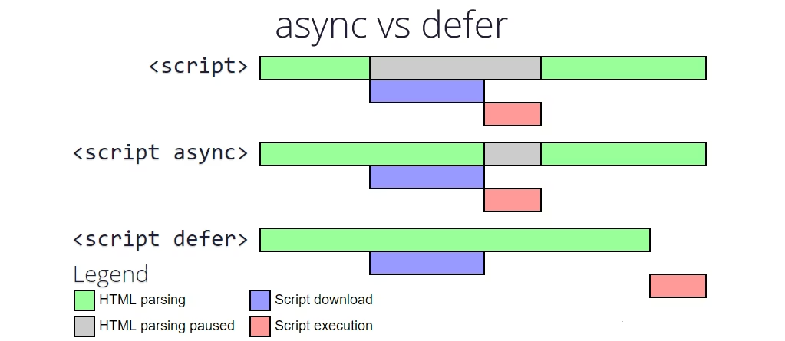

# 2025/11/26 JavaScript 授業ノート

## script タグの defer 属性

外部 JavaScript ファイルを読み込む際の属性。

```html
<script src="js/script.js" defer></script>
```

defer の動作
スクリプトのダウンロードは HTML の解析と並行で進む。
実行は HTML 文書の構文解析が完了した後に行われる。
順番は HTML に書かれた順序が守られる。

---

## async と defer の違い


**defer（ディファー）**  
読み込みは非同期、実行は HTML 解析後まで遅らせる（順番は守られる）。
DOM を操作する処理や、実行順序が重要なスクリプトに向いている。

**async（エイシンク）**  
読み込みは非同期、読み込みが終わりしだいすぐ実行（順番はバラバラ）。
広告タグやアクセス解析など、独立したスクリプトに向いている。

**blocking（無指定）**  
async も defer も付けない無属性の script タグ。
HTML の解析を途中で止めてスクリプトを実行するため「ブロッキング」と呼ばれる。
基本的に避けるべき書き方。

**判断基準**  
依存関係がなければできるだけ async。
依存関係があれば defer。
document.write 使用時は無指定（blocking）だが、そもそも使用を避ける。

**async と defer の読み方・語源**  
async（エイシンク）: asynchronous（エイシンクロナス）の略。意味は「非同期の」。
defer（ディファー）: 略語ではなく独立した英単語。語源はラテン語で「後ろに運ぶ」→「延期する」。

**blocking="render" 属性（補足）**  
最近の HTML 仕様で追加された属性。  
「レンダリング（画面描画）をブロックする」という意味。  
FOUC（一瞬崩れた表示が見える現象）を防ぐために使う。  
記事で言う「blocking（無指定）」とは別の話なので注意。  

---

## console.log と console.dir

console.log と console.dir はどちらも console オブジェクトの「メソッド」。

**console.log()**  
コンソールにメッセージや値を出力するメソッド。
文字列、数値、配列、オブジェクトなど何でも渡せる。
DOM 要素を渡すと HTML ツリー的な見た目で表示される。

**console.dir()**  
指定したオブジェクトのプロパティを階層的なリストとして表示するメソッド。
オブジェクトの中身を詳しく見たいときに向いている。

**window とは**  
ブラウザー環境における「グローバルオブジェクト」。
Web ページ全体のウィンドウを表すオブジェクト。

コード例:
```javaScript
console.log('コンソールにメッセージを表示');
console.dir(window);
```
---

## document.querySelector

CSS セレクターで指定した最初の要素を取得するメソッド。
```javaScript
document.querySelector('#id名');        // ID で取得
document.querySelector('.class名');     // クラスで取得
document.querySelector('タグ名');       // タグで取得
```
HTML 要素を JavaScript から操作するために取得する。  
一致した最初の要素（Element オブジェクト）を返す。  
見つからない場合は null を返す。  

コード例:
```javaScript
console.log('JS準備完了');
console.dir(document.querySelector('#colorPicker').value);

document.querySelector('#colorText').textContent;
console.log(document.querySelector('#colorText').textContent);

document.querySelector('#colorText').textContent = 'カラーコード:';
```
---

## テキスト関連のプロパティ

**textContent**  
要素のテキストのみを取得・設定。
HTML タグは解釈されず、そのまま文字列として扱われる。

**innerHTML**  
要素の HTML も含めて取得・設定。
HTML タグが解釈されて、実際の HTML 要素として挿入される。

**innerText**  
表示されているテキストのみを取得・設定。
非表示の要素は取得されない。

---

## 文字列の連結とテンプレートリテラル

**+ での連結**  
'カラーコード: ' + 変数 + 'あいうえお'

**テンプレートリテラル（推奨）**  
`カラーコード: ${変数}あいうえお`

**バッククォート（`）で囲む。**  
変数や式は ${  } の中に書く。  
複数行の文字列も書ける。  
コード例:
```javaScript
document.querySelector('#colorText').textContent = 
    `カラーコード: ${document.querySelector('#colorPicker').value}`;
```
---

## 定数への代入
```javaScript
const text = document.querySelector('#colorText');
const color = document.querySelector('#colorPicker');
text.textContent = `カラーコード: ${color.value}`;
```
要素を定数に代入することで、コードが短く読みやすくなる。  
const は一度代入したら再代入できない。  
プロパティの変更は可能。  

---

## 変数名・定数名のルール

**使える文字**  
1文字目: アルファベット、_、$
2文字目以降: アルファベット、数字、_、$

**使えない文字**  
ハイフン（-）は使えない（引き算として認識される）  
空白（スペース）は使えない  
数字から始められない  
予約語は使えない

**推奨の命名規則**  
キャメルケース（camelCase）: colorPicker, userName
```javaScript
間違った例:
const color-picker = document.querySelector('#colorPicker');  // ❌ エラー

正しい例:
const colorPicker = document.querySelector('#colorPicker');   // ⭕ OK
```
---

## JavaScript の予約語（一部）

await, break, case, catch, class, const, continue  
default, delete, do, else, export, extends  
false, finally, for, function, if, import, in  
instanceof, new, null, return, super, switch  
this, throw, true, try, typeof, var, void  
while, with, yield

---

## イベントリスナー

「きっかけ」を作る仕組み。
ユーザーの操作に応じて何らかの動作を引き起こす。

基本の書き方
要素.addEventListener('イベント名', 実行する関数);

コード例（名前付き関数）:
```javaScript
const text = document.querySelector('#colorText');
const color = document.querySelector('#colorPicker');

const colorBG = () => {
    text.textContent = `カラーコード: ${color.value}`;
}

color.addEventListener('input', colorBG);
```

コード例（無名関数）:
```javaScript
color.addEventListener('input', () => {
    text.textContent = `カラーコード: ${color.value}`;
});
```

主なイベント  
change: 値が変更されて、フォーカスが外れたとき  
input: 入力されるたびに（リアルタイム）  
click: クリックされたとき  
mouseover: マウスが要素の上に乗ったとき

---

## 関数の定義方法

アロー関数
```javaScript
const 関数名 = () => {
    処理内容
}
```
ES6 から追加された新しい書き方。  
const で定義するため、再代入できない。  
定義前に呼び出せない（巻き上げなし）。

従来の関数（function 構文）
```javaScript
function 関数名() {
    処理内容
}
```
JavaScript の最初からある書き方。
定義前に呼び出せる（巻き上げあり）。

コード例:
```javaScript
// 関数宣言(function構文) 巻き上げ（ホイスティング）が起こる
// test(); // ⭕ 定義前に呼び出せる
function test(a) {
    console.log('関数testが実行されました');
    console.log(`今日の天気は ${a}`);
}

test('晴れ');
test('雨');

// アロー関数(関数式: 代入)
// arrowTest(); // ❌ エラー: 定義前には呼び出せない

const arrowTest = (a, b) => {
    console.log('アロー関数が実行されました');
    console.log(`今日の天気は ${a} ${b}`);
};

arrowTest('曇り', '☁️');
```

---

## 関数の呼び出し
```javaScript
const message = () => {
    console.log('こんにちは！');
}

message();  // () を付けると実行される
```
注意点
- 関数名: 関数そのもの（実行されない）
- 関数名(): 関数を実行する

イベントリスナーでは () を付けない。
```javaScript
// ⭕ 正しい
addEventListener('click', message);

// ❌ 間違い
addEventListener('click', message());
```
---

## 引数（パラメータ）

関数に渡す「入力値」
```javaScript
const message = (name) => {
    console.log(`${name} さん、こんにちは！`);
}

message('Mana');    // Mana さん、こんにちは！
message('達也');    // 達也 さん、こんにちは！
```
- 仮引数: 定義時の (name)
- 実引数: 呼び出し時の ('Mana')

複数の引数:
```javaScript
const message = (name, weather) => {
    console.log(`${name}さん、こんにちは！今日は${weather}です。`);
}

message('Mana', 'いい天気');
message('達也', '雨');
```
引数のデフォルト値:
```javaScript
const message = (name = 'ゲスト') => {
    console.log(`${name}さん、こんにちは！`);
}

message();  // ゲストさん、こんにちは！
```
---

## return（戻り値）

関数が処理した結果を「返す」ためのキーワード。
```javaScript
const message = (name, weather) => {
    return `${name}さん、こんにちは！今日は${weather}です。`;
}

console.log(message('Mana', 'いい天気'));
alert(message('達也', '雨'));

return なし: 直接 console.log で出力（再利用できない）
return あり: 結果を返して、他の場所で使える
```
アロー関数での省略:
```javaScript
// 1行で書ける場合、return と {} を省略できる
const message = (name, weather) => `${name}さん、こんにちは！今日は${weather}です。`;
```
---

## 無名関数（匿名関数）

関数に名前を付けずに直接書く方法。
```javaScript
color.addEventListener('input', () => {
    text.textContent = `カラーコード: ${color.value}`;
});
```
- 処理が短くて、1回しか使わないときに便利。
- イベントリスナーを削除するのが難しい。

---

## 引数の () 省略

引数が1つの場合:
```javaScript
const test = a => {
    console.log(a);
};
```
引数が0個または2個以上の場合:
```javaScript
// () が必要
const test = () => { };
const test = (a, b) => { };
```
---

## セミコロンについて

JavaScript も TypeScript もセミコロンは省略可能。  
ASI（自動セミコロン挿入）が働くため。

ただし、省略すると危険なケースがある:  
括弧から始まる行  
return の後の改行

初心者には「セミコロンをつける」方が無難。

---

## 参考リンク

script 要素 - MDN
https://developer.mozilla.org/ja/docs/Web/HTML/Reference/Elements/script

async と defer のどっちを使えばいいのか - Qiita
https://qiita.com/Tsukina_7mochi/items/e8ab5c06f9be7fe972b8

console.log() - MDN
https://developer.mozilla.org/ja/docs/Web/API/console/log_static

console.dir() - MDN
https://developer.mozilla.org/ja/docs/Web/API/console/dir_static

document.querySelector() - MDN
https://developer.mozilla.org/ja/docs/Web/API/Document/querySelector

textContent プロパティ - MDN
https://developer.mozilla.org/ja/docs/Web/API/Node/textContent

addEventListener() - MDN
https://developer.mozilla.org/ja/docs/Web/API/EventTarget/addEventListener

アロー関数 - MDN
https://developer.mozilla.org/ja/docs/Web/JavaScript/Reference/Functions/Arrow_functions
